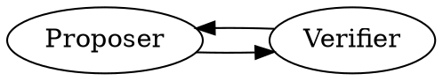
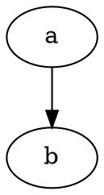

# Yikai Zhang — personal site

A custom, minimal Astro site. Static HTML, local fonts, no browser-side JavaScript
in the production pages. Built independently of the old academic homepage template.

## Local preview

Requires Node.js 22.12+ (Node.js 24 recommended).

```sh
npm ci
npm run dev
```

Open http://127.0.0.1:4321/. Astro 7 keeps the development server running in the
background; stop it with `npx astro dev stop` from this directory.

## Edit the profile

Name, work, emails, social links and education: `src/data/profile.ts`.
Homepage wording and layout: `src/components/HomePage.astro`.
Styles: `src/styles/global.css`.

The homepage name uses Cormorant Garamond, medium italic. Fonts are served locally.

## Add a blog post

Copy `src/content/posts/first-post.md` to a descriptive filename, such as
`src/content/posts/llm-agents.md`. Replace the example content and metadata:

```yaml
---
title: "My article title"
description: "A short description for search results."
date: 2026-09-14
draft: false
---
```

Write the article below the metadata using Markdown. Its URL will be
`/writing/llm-agents/`. Add images to `public/images/` and reference them as
``.

- `draft: true` excludes a post from **both** lists and generated article URLs.
- The Writing navigation is always visible. Before the first post, its page shows
  “Notes and essays, coming soon.” Publishing adds the latest posts to the homepage.
- The homepage shows the latest three articles. `/writing/` lists all articles.
- Articles share `src/layouts/ArticleLayout.astro`: title, description, author,
  date, and a comfortable reading column. A table of contents appears
  automatically once an article has three or more `##`/`###` headings.
- The included template is a draft and is never published by default.

## Rich formatting

Everything below is plain Markdown and is rendered at build time. The published
pages still contain no browser-side JavaScript.

**Maths.** Write `$e^{i\pi} + 1 = 0$` inline, or put `$$ … $$` on its own lines
for a displayed equation. KaTeX renders it during the build.

**Diagrams.** A fenced `dot` block becomes an inline SVG via Graphviz:

````markdown

````

**Figures and captions.** Wrap anything in a `figure` directive to get a centred,
automatically numbered caption (`Fig. 1.`, `Fig. 2.`, … per article). Point it at
a file with `src`, or nest a diagram inside it. Add `wide` to let a figure spill
past the reading column. The caption is always the last paragraph in the block:

```markdown
:::figure{src="/images/ladder.svg" alt="Four bars of increasing length."}
The caption, which may contain *emphasis* and [links](/writing/).
:::

:::figure{wide}

The caption goes last; everything above it is the figure body.
:::
```

**Callouts.** `:::note`, `:::aside` and `:::warning`, with an optional title in
square brackets:

```markdown
:::note[A small aside]
Callouts hold a useful detail without breaking the flow of the article.
:::
```

**References.** Ordinary Markdown footnotes (`[^key]`) collect themselves into a
quiet list at the end of the article.

Hand-drawn figures belong in `public/images/` as `.svg` or `.png`; reference them
from the `figure` directive above, or inline as ``.

## Preview article typography

While the development server is running, open `/preview/article/` to see the draft
sample in the actual article layout. This route is excluded from production builds
and has `noindex` metadata. It is not linked from the public Writing list.

## Publish to GitHub Pages

```sh
npm run build
```

The `dist/` folder contains the complete static site. The canonical site URL is
configured in `astro.config.mjs` as `https://arist12.github.io`.

Push changes to `main` to publish. `.github/workflows/deploy.yml` installs the locked
dependencies, builds the site, and deploys to GitHub Pages. The repository's Pages
source is GitHub Actions. You can also run the workflow manually from the Actions tab.

To publish a post directly on GitHub, add a Markdown file under `src/content/posts/`
with the metadata above and `draft: false`, then commit to `main`. The site rebuilds
automatically. Upload article images to `public/images/` in the same way.

This repository's history was rewritten to start at the redesign; the Jekyll
academic-homepage template that preceded it is no longer part of it.
