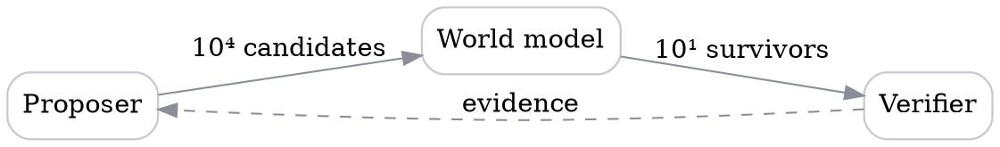

This is a typography sample, not a published article. It shows how paragraphs,
headings, code, figures and maths sit together on the page.

## Room to think

Good writing needs a little space. A comfortable line length and a steady rhythm
between paragraphs help the reader follow an idea, one step at a time.

You can use **bold for emphasis**, *italics for an aside*, and
[links to other pages](/writing/) without interrupting that rhythm.

> A useful note deserves room to breathe.

## Maths

Write inline maths as $\sigma(z)_i = e^{z_i} / \sum_j e^{z_j}$, and give a
result its own line when it carries the argument:

$$
\mathcal{L}(\theta) = -\mathbb{E}_{x \sim \mathcal{D}}\left[\log p_\theta(x)\right]
$$

## Diagrams

A fenced `dot` block becomes an SVG diagram at build time. Nothing is rendered
in the reader's browser.

:::figure{wide}

The verification loop. A proposer is cheap, the verifier is not, and a world
model stands in for the verifier on everything that is not worth measuring.
:::

To place a caption under a drawing you made elsewhere, point the same directive
at a file in `public/images/`:

:::figure{src="/images/example.svg" alt="A description of the drawing."}
Hand-drawn figures live in `public/images/` and are numbered automatically.
:::

## A small example

Code is part of the conversation. It gets a quiet background, syntax highlighting,
and its own horizontal scroll when a line is long.

```python
def greet(name: str) -> str:
    return f"Hello, {name}."


print(greet("world"))
```

## A few things to remember

- Start with one idea.
- Use headings to give the reader a sense of place.
- Include an example when it makes an explanation clearer.

:::note[A small aside]
Callouts hold a useful detail without breaking the flow of the article.
Use `:::note`, `:::aside` or `:::warning`.
:::

| Element | Purpose |
| --- | --- |
| A heading | Introduce the next idea |
| A code block | Show the exact example |
| A quotation | Give a thought its own space |

References use ordinary Markdown footnotes and collect themselves at the
bottom.[^funsearch]

[^funsearch]: Romera-Paredes et al. Mathematical discoveries from program search
with large language models. *Nature* 625, 468–475 (2023).

## 也可以用中文写作

不需要额外设置。中文、英文和代码可以放在同一篇文章里，保持自然的行距与清晰的层级。
写完后，把文件中的 `draft` 改成 `false`，文章就会出现在列表中。
